# Hi, I'm zwdemz

**Security Tool Developer · Web3 & Blockchain Learner · DevSecOps Practitioner**

## About me

I build practical security tools and keep exploring the intersection of **Web3**, **cloud-native infrastructure**, and **DevSecOps**. I enjoy turning complex engineering and security problems into clear, maintainable solutions.

- Building developer-friendly security tooling
- Learning Web3 and blockchain engineering
- Practising cloud infrastructure, automation, and secure delivery

## Focus areas

<table>
  <tr>
    <td width="33%" valign="top">
      <h3>Security Engineering</h3>
      
Security tools, secure coding, and practical defensive workflows.

    </td>
    <td width="33%" valign="top">
      <h3>Cloud & DevSecOps</h3>
      
Automation, containers, CI/CD, and reliable infrastructure.

    </td>
    <td width="33%" valign="top">
      <h3>Web3 Exploration</h3>
      
Learning blockchain foundations and the developer ecosystem.

    </td>
  </tr>
</table>

## Technology toolkit

  
   
  
   
  

## GitHub at a glance

  
  

## Contribution activity

  <picture>
    <source media="(prefers-color-scheme: dark)" srcset="https://raw.githubusercontent.com/zwdemz/zwdemz/output/github-contribution-grid-snake-dark.svg" />
    <source media="(prefers-color-scheme: light)" srcset="https://raw.githubusercontent.com/zwdemz/zwdemz/output/github-contribution-grid-snake.svg" />
    
